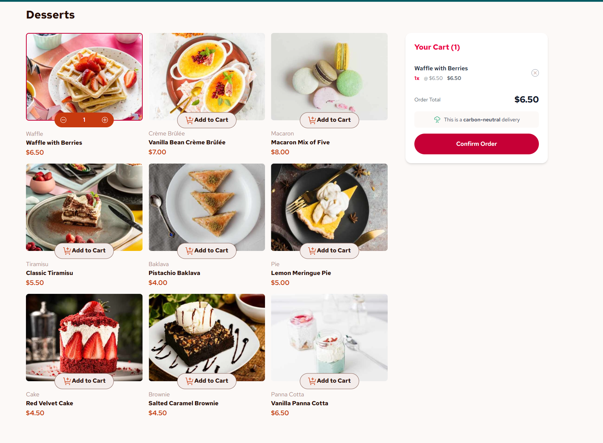

# Dessert Product List & Cart (PO)

A responsive React + Tailwind CSS app where users can browse a selection of desserts, add items to their cart, adjust quantities, and view a live order summary. The cart is always accessible on larger screens, and a confirmation modal provides a polished checkout experience. The layout adapts seamlessly across devices, with a grid for products and a fixed-width, top-right cart for desktop/tablet. This project demonstrates modern React state management, responsive design, and clean UI/UX practices.
